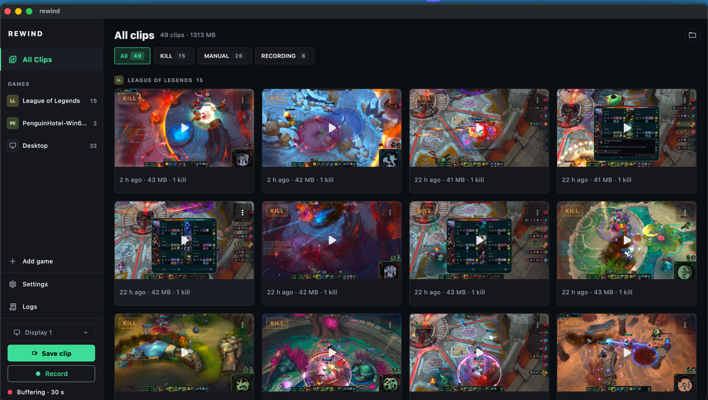
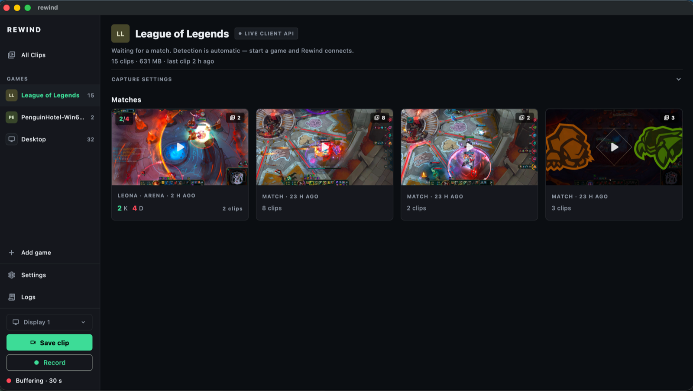
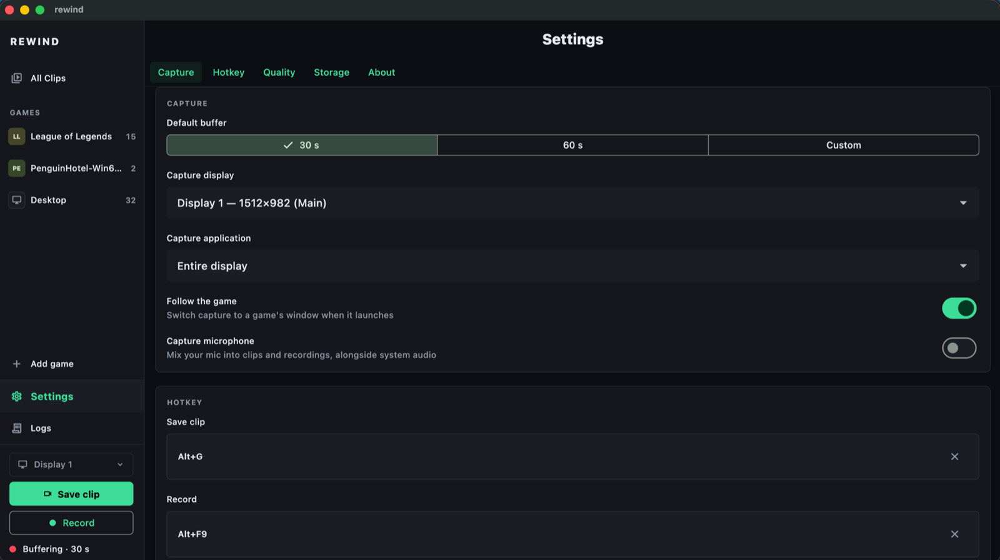

# Rewind

**Open-source, cross-platform instant-replay and automatic game-clip capture for Windows and macOS.**

<!-- Update the slug below if your repo lives elsewhere. -->
[](https://github.com/abdelaziz-mahdy/rewind/actions/workflows/ci.yml)
[](https://github.com/abdelaziz-mahdy/rewind/actions/workflows/release.yml)
[](https://github.com/abdelaziz-mahdy/rewind/releases)
[](LICENSE)


Rewind keeps a rolling buffer of your last N seconds of gameplay and saves a clip the moment something worth keeping happens — either when you press a hotkey, or automatically when your game reports an in-game event (a kill, an ace, a dragon steal). It's the ShadowPlay / Medal-style experience that Windows has always had, brought to macOS too, in a single app.



<p align="center">
  
  &nbsp;
  
</p>

<p align="center"><sub>Left: a game hub — clips grouped into match cards with your K/D, champion, and mode. Right: capture settings.</sub></p>

> **Get it:** grab the macOS `.dmg`, the Windows installer, or the Windows
> **portable zip** (unzip and run `rewind.exe`, no install) from the
> [latest release](https://github.com/abdelaziz-mahdy/rewind/releases) — built
> automatically on every tag by the [release workflow](.github/workflows/release.yml).
> First macOS launch: right-click → Open (unsigned for now).

> Status: **alpha.** Real capture + League auto-clipping work on macOS
> (replay buffer, hotkey/in-app saves, per-display/app/window targeting,
> auto-follow of detected games, kills/deaths + champion/mode per match,
> game-centric library UI). Windows now has a real capture backend too
> (display/window capture, WASAPI audio, NVENC/AMF/QSV/x264 hardware
> encoding — see `native/shim/README.md`), compiled and CI-verified against
> the real libobs SDK, but **not yet validated on real Windows hardware** —
> it needs a tester with a Windows machine before it can be trusted. See
> [ROADMAP.md](ROADMAP.md).

## Highlights

- **Instant replay, no manual start.** The last 15–60 s are buffered automatically while you play — save with a hotkey or a button. (The buffer pauses at the desktop by default to save CPU; flip that off in Settings for always-on buffering.)
- **Games clip themselves.** League of Legends auto-clips your kills/aces from the Live Client API — only *your* plays — and tracks each match's full **K/D/A, creep score, ward score, champion + skin, item build, and teammates'/opponents' champions and names**.
- **Steam achievements clip themselves — any Steam game.** Add your Steam ID + a Web API key once, and a new achievement unlock auto-saves a clip labeled with its real name, in whatever Steam game you're playing.
- **Auto-detect & follow.** Popular games are detected on launch; capture follows the game's window. Any app (including CrossOver/Wine games) can be added — the left rail shows each game's real app icon.
- **A library built around games.** Each game gets a hub; clips group into **match cards** (with champion art) you can drill into for the full stat line and item build.
- **You're in control.** Framerate/resolution, audio source (none / game-only / all apps) + mic, storage limits with auto-cleanup, a custom recordings folder, and rebindable hotkeys.
- **Mac-first, honest about it.** Native ScreenCaptureKit + VideoToolbox; ~17 % CPU idle for always-on capture, tunable down via the quality settings.

---

## Why Rewind exists

On Windows, gamers have NVIDIA Instant Replay, Medal.tv, and Outplayed — background recorders that auto-clip highlights. On macOS almost none of this exists, and the tools that do (ClipMac, RetroClip, MacClipper) are manual-hotkey only, with no automatic in-game event detection. Rewind closes that gap with one codebase that runs on both platforms.

## How it works

Rewind is a **Flutter** desktop app (shared UI + logic) sitting on top of an **embedded [libobs](https://github.com/obsproject/obs-studio) capture engine** (the same battle-tested core that powers OBS Studio). libobs handles efficient screen capture, hardware video encoding, and the in-memory replay buffer. Rewind drives it through a small **C shim** exposed to Dart via `dart:ffi`.

```
+-------------------------------------------------------------+
|  Flutter (Dart) — UI, settings, clip library, hotkeys       |
|  + Event watchers (e.g. League Live Client Data API @2999)  |
+---------------------------+---------------------------------+
                            | dart:ffi
+---------------------------v---------------------------------+
|  Rewind C shim (native/shim) — thin, stable C API           |
+---------------------------+---------------------------------+
                            | C
+---------------------------v---------------------------------+
|  libobs — capture, hardware encode, replay ring buffer      |
+-------------------------------------------------------------+
```

When a game event fires (or you hit the hotkey), Dart calls `rewind_save_clip()` and libobs flushes the last N seconds to an `.mp4`.

See [ARCHITECTURE.md](ARCHITECTURE.md) for the full design.

## Features

- Rolling replay buffer (RAM-backed) — **working on macOS**; a Windows real-capture backend exists and compiles in CI but is **untested on real hardware**
- **Manual hotkey clip** ("clip that") saving the last **15s / 30s / 60s / custom** — configurable **per game**, hotkey set by pressing it
- **Manual recording**: a deck button and a dedicated hotkey (default **Alt+F9**) start/stop a continuous recording, independent of the replay buffer, with a live elapsed-time readout and a matching tray item
- **Automatic game detection** (process catalog + per-app watchers) with **auto-follow capture**: start a game and recording switches to it
- **Game-centric library**: each game is a destination — its clips, event filters, detection status, and settings in one hub
- Capture a **specific display or application**, switchable from the main screen
- **In-app playback** (media_kit) and event-type badges on every clip
- **Automatic event-based clipping** — League of Legends via the local Live Client Data API (kills, multikills, aces, objectives) — *lands in v0.2; the UI slot is already built*
- **Steam achievement auto-clip, for any Steam game** — polls the official Steam Web API for a new achievement unlock and saves a clip labeled with its real name; needs a one-time Steam ID + Web API key in Settings → Steam
- **Per-match League tracker**: live K/D/A, creep score, and ward score (polled from the Live Client Data API), champion portrait + skin name and final item build (Data Dragon art), and each teammate's/opponent's champion **and in-game name**, shown on every match card and its detail screen
- **Real game icons in the rail** — read from each game's installed app bundle at runtime, no bundled artwork (League keeps its monogram: its app icon is Riot's official logo, which Riot's asset policy excludes even though champion/item art is explicitly permitted)
- Hardware-accelerated encoding (Apple VideoToolbox on macOS; NVENC → AMF → Quick Sync → x264 fallback ladder on Windows, untested on hardware)
- Menu-bar / tray background operation, in-app logs, precise permission diagnostics

## Supported games (event auto-clipping)

| Game | Method | Status |
|------|--------|--------|
| League of Legends | Live Client Data API (`127.0.0.1:2999`) — official, read-only, anti-cheat safe | Planned (v0.2) |
| Any Steam game | Official Steam Web API (`api.steampowered.com`) — achievement unlocks | Shipped |
| VALORANT | Manual hotkey capture only, permanently — **Windows-only** (Vanguard blocks all VM/CrossOver capture paths), and Riot's developer policy restricts real-time match data | Planned (v0.1) |
| Marvel Rivals | Manual hotkey capture only — no sanctioned event source (no public API, encrypted logs); Windows native, **macOS via CrossOver** | Planned (v0.1) |
| Any game (incl. MECCHA CHAMELEON & other mech/action titles) | Manual hotkey capture — always safe | Planned (v0.1) |
| More titles | Per-game integrations (sanctioned sources only) | Future |

Initial test targets are **League of Legends** (event auto-clipping via the
official local API) and a second title, **MECCHA CHAMELEON** (a mech action game), which
runs in **manual-hotkey mode** unless the vendor exposes a sanctioned event
source. See [docs/COMPLIANCE.md](docs/COMPLIANCE.md).

The full, live list of auto-detectable titles — plus each one's detection
method and whether it's running or already in your library — is in-app under
**+ Add game** (`lib/src/ui/supported_games_screen.dart`), sourced from the
same `popularGamesCatalog` the table above summarizes.

## Building

Requires the Flutter SDK (desktop enabled). The native C shim is compiled and
bundled automatically by a Dart **build hook** (`hook/build.dart`) — no per-OS
build files to manage. Full setup in [CONTRIBUTING.md](CONTRIBUTING.md).

```bash
flutter pub get
flutter run -d macos      # or: flutter run -d windows
```

That runs in **stub capture mode** (UI works, no video written). For **real
recording on macOS**, build the pinned libobs SDK once, then run again:

```bash
bash tools/fetch_libobs.sh   # one-time, cached under native/third_party/
flutter run -d macos
```

macOS will ask for **Screen Recording** permission on first capture (System
Settings → Privacy & Security → Screen Recording); grant it and relaunch.
Details, including packaging a distributable .app, in
[native/shim/README.md](native/shim/README.md) and
[CONTRIBUTING.md](CONTRIBUTING.md).

## Legal & safety

Rewind is designed to be **ToS-friendly and anti-cheat safe**: game integrations
use only **sanctioned data sources** (official local APIs, logs, or SDKs) or
plain screen capture — **never** memory reading, injection, or hooking. Games
without an official API are supported in manual-hotkey mode only. See
[docs/COMPLIANCE.md](docs/COMPLIANCE.md). (Not legal advice.)

## License

Rewind is licensed under the **GNU General Public License v3.0** — see [LICENSE](LICENSE). GPLv3 is required because Rewind embeds libobs, which is GPL-licensed. This means Rewind is and will remain free and open source.

## Contributing

Contributions welcome — see [CONTRIBUTING.md](CONTRIBUTING.md) and the [ROADMAP.md](ROADMAP.md) for where help is most useful.

## Legal

Rewind is not endorsed by Riot Games and does not reflect the views or opinions
of Riot Games or anyone officially involved in producing or managing Riot Games
properties. Riot Games and all associated properties are trademarks or
registered trademarks of Riot Games, Inc.

(Required by Riot's Developer API Policy, since Rewind reads League's official
local Live Client Data API and renders Data Dragon static art — see
[docs/COMPLIANCE.md](docs/COMPLIANCE.md).)
